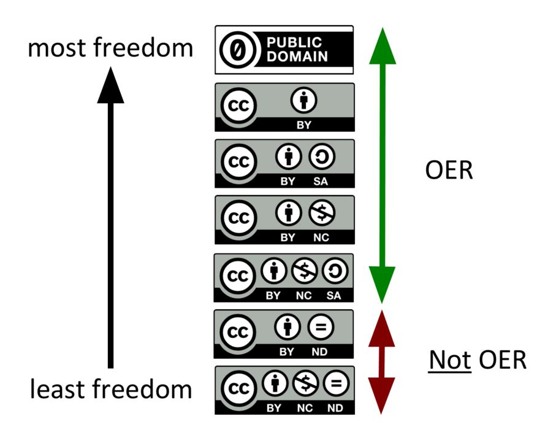
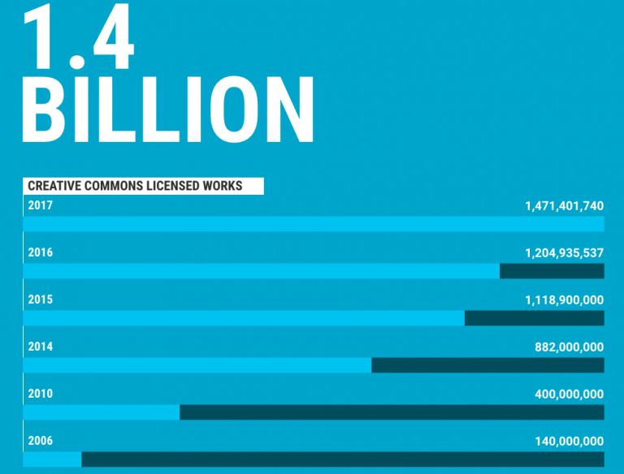

## Module: Open Licensing and Creative Commons

### Why it Matters
> This module is designed to introduce you to the concept of open licenses for academic work and explore the history of Creative Commons as an organization and a set of licenses. You will learn about the advantages and disadvantages of each license and see examples of how they can be applied. 

### Learning Outcomes
In this module, you will:
- **Identify** the tensions between traditional copyright and the internet
- **Identify** the different Creative Commons licenses
- **Apply** open licenses to different works

## 1. Copyright and the Internet
Copyright applies to works of original authorship, which means works that are unique and not a copy of someone else’s work, and most of the time requires fixation in a tangible medium (written down, recorded, saved to your computer, etc.).

Copyright law establishes the basic terms of use that apply automatically to these original works. These terms give the creator or owner of copyright certain exclusive rights while also recognizing that users have certain rights to use these works without the need for a license or permission. 

Educators have always had a complicated relationship with copyright, mostly due to the complicated and ambiguous definition of "fair use." But the internet has afforded significant new possibilities for educators to remix, remediate, and redistribute their own knowledge work and the work of others, and traditional copyright has come to represent a frustrating barrier for teachers who want to make as much knowledge as possible accessible to their students. Use the timeline exercise below to explore how the court cases of the 1990s brought this fundamental tension to a head. 

<iframe src="https://h5p.cwr.olemiss.edu/h5p/embed/66" width="100%" height="775" frameborder="0" allowfullscreen="allowfullscreen"></iframe>

Practicing Open Pedagogy and developing Open Educational Resources (OER) doesn't mean you have to be an expert in copyright law. The Open Culture community, and Creative Commons especially, have created tools and resources that are designed specifically to help educators navigate licensing and sharing educational materials. 

## 2. Creative Commons
Inspired by the value of Eldred’s goal to make more creative works freely available on the internet, and responding to a growing community of bloggers who were creating, remixing and sharing content, Lessig and others came up with an idea. They created a nonprofit organization called Creative Commons and, in 2002, they published the Creative Commons licenses—a set of free, public licenses that would allow creators to keep their copyrights while sharing their works on more flexible terms than the default “all rights reserved.” Copyright is automatic, whether you want it or not. And while some people want to reserve all of their rights, many want to share their work with the public more freely. The idea behind CC licensing was to create an easy way for creators who wanted to share their works in ways that were consistent with copyright law.

From the start, Creative Commons licenses were intended to be used by creators all over the world. The CC founders were initially motivated by a piece of U.S. copyright legislation, but similarly restrictive copyright laws all over the world restricted how our shared culture and collective knowledge could be used, even while digital technologies and the internet have opened new ways for people to participate in culture and knowledge production.

Since Creative Commons was founded, much has changed in the way people share and how the internet operates. In many places around the world, the restrictions on using creative works have increased. Yet sharing and remix are the norm online. Think about your favorite video mashup or even the photos your friend posted on social media last week. Sometimes this type of sharing and remix happen in violation of copyright law, and sometimes they happen within social media networks that do not allow those works to be shared on other parts of the web.

In domains like textbook publishing, academic research, documentary film, and many more, restrictive copyright rules continue to inhibit creation, access, and remix. CC tools are helping to solve this problem. Today Creative Commons licenses are used by more than 1.4 billion works online across 9 million websites. The grand experiment that started more than 15 years ago has been a success, including in ways unimagined by CC’s founders.

### Show What you Know: Interactive Video 
> Watch the interactive video below (based on ["A Shared Culture"](https://vimeo.com/13864570) from Creative Commons). Answer the questions in the video and use your responses to write this week's journal entry. 

<iframe src="https://h5p.cwr.olemiss.edu/h5p/embed/68" width="100%" height="550" frameborder="0" allowfullscreen="allowfullscreen"></iframe>

> Developer's Note: The H5P interactive video content type doesn't support YouTube closed captions (yet). If this module ever went into production, I would upload a copy of the video with the captions added. 

## 3. The Licenses
Today, the CC licenses and public domain tools are used on more than 1.4 billion works, from songs to YouTube videos to scientific research. The licenses have helped a global movement come together around openness, collaboration, and shared human creativity. CC the nonprofit organization, once housed within the basement of Stanford Law School, now has a staff working around the world on a host of different projects in various domains.

Different licenses are appropriate for different kinds of work. Use the interactive activity below to learn about each license type and start thinking about how they apply to your own work.

### Learn by Doing: Image Hotspots
<iframe src="https://h5p.cwr.olemiss.edu/h5p/embed/67" width="500" height="900" frameborder="0" allowfullscreen="allowfullscreen"></iframe>

For educational work, not all of these licenses are considered "open." If you are developing or user Open Educational Resources, make sure to keep an eye out for ND licenses. Though it is possible to work with this content in an OER project, it presents a number of difficulties. 

Now that you've learned about each of the CC licenses, take this quiz to see if you can apply that knowledge. 

### Show What you Know: License Quiz
<iframe src="https://h5p.cwr.olemiss.edu/h5p/embed/70" width="100%" height="550" frameborder="0" allowfullscreen="allowfullscreen"></iframe>

## 4. Licensing your Existing Work
Should you put CC licenses on your existing course materials? We have all developed countless teaching resources over the years, but probably haven't thought much about applying licenses to them. Many institutions grant full copyright ownership of course materials to the faculty that create them (but check with your school's legal affairs office to be sure). 

**Context** 
- Your work is already being shared, with and without your permission. 
- Private companies, like Course Hero, profit from your work. 
- Students in privileged groups have access to materials that other students do not.
- Work and energy is wasted through duplication of effort among teachers.

**Advantages**
- More people see your good work
- The product of your effort lives longer
- You can share it with other people
- Join the scholarly conversation
- Your work can to contribute to future classes.

![Benefits of Open Licensing : Syllabus: Syllabus content is already shared and remixed. If we openly license them, the process would be more efficient and transparent. Students who want access to all faculty syllabi would be pleased, transfer equivalency decisions would be easier, Handouts and Notes: Licensing and sharing documents in a structured way ensures that useful content is never lost. How many times have you found a good resource on the copier? Licensing would allow collaboration and enrichment rather than simple covert copying, Videos and Media: Licensing would encourage sharing access to source material. Teachers could adapt and customize multimedia content instead of just using it and telling students to ignore the random person narrating the video.](media/benefits.PNG)

## 5. Creative Commons Global Network and the Future
Over the years, a global coalition of people has formed around Creative Commons and open licensing. This includes activists working on copyright reform around the globe, policymakers advancing policies mandating open access to research and data, and creators who share a core set of values. Most of the people and institutions who are part of the CC movement are not formally connected to Creative Commons.

The [CC Global Network](https://network.creativecommons.org/) is just one player in the larger open movement, which includes Wikipedians, Mozillians, open access advocates, and many more.

Open source software is cited as the first domain where networked open sharing produced a tangible benefit as a [movement](https://en.wikipedia.org/wiki/Open-source_software_movement) that went much further than technology. The [Conversation’s Explainer](https://theconversation.com/explainer-what-is-the-open-movement-10308) overview of other movements adds other examples, such as [Open Innovation](http://corporateinnovation.berkeley.edu/) in the corporate world, [Open Data](https://en.wikipedia.org/wiki/Open_data) and [Crowdsourcing](https://en.wikipedia.org/wiki/Crowdsourcing). 

There is also the Open Access movement, which aims to make research widely available, the Open Science movement, and the growing movement around Open Educational Resources. Your main interest in taking this course is to develop Open Educational Resources the improve your students' learning experience. OER could not happen without Creative Commons. 

By the end of 2017, there were over 1.4 billion CC-licensed works. The Creative Commons English Language search engine was used over 3.3 million times. As you start to develop your own content, resources from Creative Commons will ensure that you never have to start from scratch.

## Module Quiz 
> Developer's Note: Because this demonstration module is not attached to an LMS, quiz scores are collected anonymously in [Open Assessments](https://www.openassessments.org).

 <iframe id="openassessments_container" src="//www.openassessments.org/assessments/load?confidence_levels=true&src_url=https://www.openassessments.org/api/assessments/1518.xml&results_end_point=https://www.openassessments.org/api&assessment_id=1518&eid=idad6cbd232c482012b065d83b2ab3517" frameborder="0" style="border:none;width:100%;height:100%;min-height:400px;"></iframe>

## Licenses and Attributions
### CC licensed content, Original
- Benefits of Open Licensing. Authored by: Andrew Davis.  Located at: [https://docs.google.com/presentation/d/1Z8bm-wL5TedDDGNBWn8FF7W3O2P3g5A4NYCUJvnID6E/edit#slide=id.g42d56e809f_1_36](https://docs.google.com/presentation/d/1Z8bm-wL5TedDDGNBWn8FF7W3O2P3g5A4NYCUJvnID6E/edit#slide=id.g42d56e809f_1_36)

### CC licensed content, Shared Previously
- 1.4 Billion Creative Commons Works. Located at: [https://stateof.creativecommons.org/](https://stateof.creativecommons.org/). License: CC-BY: Attribution 

- Most Free/Least Free Licenses. Authored by: Cable Green. Located at: [https://drive.google.com/file/d/0BymYUA-4kKX-cVFtUnZPSjRDTG8/view](https://drive.google.com/file/d/0BymYUA-4kKX-cVFtUnZPSjRDTG8/view) Project: Taking OER Mainstream. License: CC BY: Attribution

### CC licensed content, Specific attribution
- What is Creative Commons?. Provided by: Creative Commons. Located at: [https://certificates.creativecommons.org/cccertedu/chapter/1-what-is-creative-commons/](https://certificates.creativecommons.org/cccertedu/chapter/1-what-is-creative-commons/). Project: Creative Commons Certificate for Educators and Librarians. License: CC BY: Attribution

- Copyright Law. Provided by: Creative Commons. Located at: [https://certificates.creativecommons.org/cccertedu/chapter/2-copyright-law/](https://certificates.creativecommons.org/cccertedu/chapter/2-copyright-law/). Project: Creative Commons Certificate for Educators and Librarians. License: CC BY: Attribution

- A Shared Culture. Authored by: Jesse Dylan. Located at: [http://creativecommons.org/videos/a-shared-culture](http://creativecommons.org/videos/a-shared-culture). License: CC BY-NC-SA: Attribution-NonCommercial-ShareAlike

---------------
 This work is licensed under a <a rel="license" href="http://creativecommons.org/licenses/by-sa/4.0/">Creative Commons Attribution-ShareAlike 4.0 International License</a>.

See this module's [Github Repository](https://github.com/adavis46/cccert_assignment1) to download and reuse H5P exercises. 
